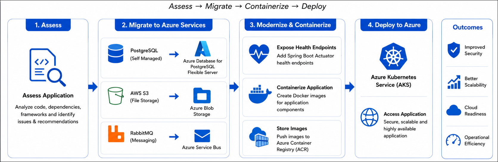
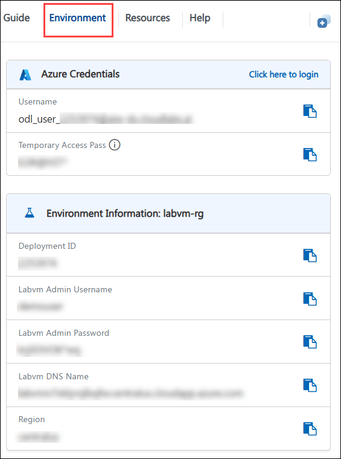

# GitHub Copilot Java App Modernization Workshop

### Overall Estimated Duration: 4 Hours 

## 📘 Workshop Scenario 

**Contoso Ltd.** is a global asset management company that operates a **legacy Java-based Asset Manager application** used by internal teams to manage digital assets, process asset-related events, and store associated metadata. Over time, the application has become increasingly difficult to maintain due to its dependence on older Java frameworks and infrastructure components hosted across multiple platforms.

The application **currently relies on a self-managed PostgreSQL database, AWS S3 for file storage, RabbitMQ for messaging, and traditional deployment methods** that limit scalability and operational efficiency. To address these challenges, Contoso has decided to modernize the application using **GitHub Copilot App Modernization** and migrate to Azure-native services and cloud-native architectures.

As a **Cloud Modernization Engineer**, you have been assigned to lead this transformation by assessing the application, modernizing its architecture, migrating dependencies, containerizing workloads, and deploying the solution to Azure Kubernetes Service (AKS).

## 📖 Overview 

In this workshop, you will use **GitHub Copilot App Modernization** to modernize a legacy Java-based application. You will analyze the existing application, identify modernization opportunities, upgrade frameworks, migrate supporting services to Azure-native alternatives, containerize the application, and deploy the modernized solution to Azure Kubernetes Service (AKS).

By the end of the workshop, you will have transformed a traditional Java application into a scalable, cloud-ready solution while gaining hands-on experience with AI-assisted application modernization workflows.

## 🎯 Objectives

After completing this lab, you will be able to:

* Assess a Java application for modernization readiness using GitHub Copilot App Modernization.
* Upgrade Java runtime and framework dependencies using AI-assisted modernization workflows.
* Migrate application data from a local PostgreSQL database to Azure Database for PostgreSQL Flexible Server.
* Replace AWS S3 storage dependencies with Azure Blob Storage.
* Migrate RabbitMQ-based messaging to Azure Service Bus.
* Implement application health monitoring using Spring Boot Actuator.
* Containerize Java application components using GitHub Copilot modernization tasks.
* Provision Azure infrastructure and deploy a modernized application to Azure Kubernetes Service (AKS).

## ⚙️ Pre-requisites

To successfully complete this workshop, you should have the following pre-requisites:
* Basic understanding of Java application development and architecture.
* Familiarity with cloud computing concepts and Azure services.

## 🏗️ Architecture

GitHub Copilot App Modernization serves as the central modernization engine, assessing the application, generating migration plans, upgrading frameworks, refactoring code, provisioning Azure resources, and automating deployment tasks. Throughout the modernization journey, application services are migrated to Azure-native alternatives including Azure Database for PostgreSQL Flexible Server, Azure Blob Storage, and Azure Service Bus.

The modernized application is containerized using Docker and deployed to Azure Kubernetes Service (AKS), enabling improved scalability, reliability, security, and operational efficiency. This architecture provides a hands-on experience of how AI-assisted tooling can accelerate enterprise application modernization with minimal manual effort.

## 🖼️ Architecture Diagram

   

## 🔍 Explanation of Components

1. **GitHub Copilot App Modernization**: A Copilot extension in VS Code that assists in assessing, planning, and executing application modernization tasks, including code refactoring, dependency upgrades, and infrastructure provisioning.

2. **Legacy Java Application**: The existing Java-based Asset Manager application that is being modernized, which currently relies on older frameworks and self-managed infrastructure components.

3. **Azure Database for PostgreSQL Flexible Server**: A fully managed database service that provides a scalable and secure environment for hosting PostgreSQL databases in Azure.

4. **Azure Blob Storage**: A scalable object storage service for unstructured data, used to replace AWS S3 for file storage in the modernized application.

5. **Azure Service Bus**: A fully managed messaging service that enables reliable communication between application components, replacing RabbitMQ in the modernized architecture.

6. **Azure Kubernetes Service (AKS)**: A managed Kubernetes service that simplifies the deployment, management, and scaling of containerized applications in Azure.

## 🚀 Getting Started with Your Lab Environment

We've prepared a seamless environment for you to explore and learn about Azure App Modernization using GitHub Copilot. Let's begin by making the most of this experience:
 
## Accessing Your Lab Environment
 
Once you're ready to dive in, your virtual machine and lab guide will be right at your fingertips within your web browser.
 

## Virtual Machine & Lab Guide
 
Your virtual machine is your workhorse throughout the workshop. The lab guide is your roadmap to success.
 
## Exploring Your Lab Resources
 
To get a better understanding of your lab resources and credentials, navigate to the **Environment** details tab.
 

 
## Utilizing the Split Window Feature
 
For convenience, you can open the lab guide in a separate window by selecting the **Split Window** button from the Top right corner.
 

 
## Managing Your Virtual Machine
 
Feel free to **Start, Restart, or Stop (2)** your virtual machine as needed from the **Resources (1)** tab. Your experience is in your hands!
 

## Lab Guide Zoom In/Zoom Out

To adjust the zoom level for the environment page, click the **A↕: 100%** icon located next to the timer in the lab environment.

## Let's Get Started with Azure Portal
 
1. On your virtual machine, click on the Azure Portal icon as shown below:
 
   .png)

2. You'll see the **Sign into Microsoft Azure** tab. Here, enter your credentials:
 
   - **Email/Username:** <inject key="AzureAdUserEmail"></inject>
 
       
 
3. Next, enter Temporary Access Pass:
 
   - **Temporary Access Pass:** <inject key="AzureAdUserPassword"></inject>
 
      
 
1. If prompted to stay signed in, you can click **No.**
 
1. If a **Welcome to Microsoft Azure** pop-up window appears, simply click "Cancel" to skip the tour.
 
## 📞 Support Contact

The **CloudLabs support** team is available 24/7, 365 days a year, via email and live chat to ensure seamless assistance at any time. We offer dedicated support channels tailored specifically for both learners and instructors, ensuring that all your needs are promptly and efficiently addressed.

Learner Support Contacts:

- Email Support: cloudlabs-support@spektrasystems.com
- Live Chat Support: https://cloudlabs.ai/labs-support

Now, click "Next" from the bottom right corner to embark on your Lab journey!
 
   .png)

### Happy Learning!!
