# GitHub Copilot Java App Modernization

### Estimated Duration: 4 Hours 

## 📖 Overview

In this lab, you will modernize **Contoso Ltd.'s** Asset Manager application using **GitHub Copilot App Modernization**. The application currently runs on legacy Java technologies and depends on multiple infrastructure components that are not optimized for modern cloud environments.

Using GitHub Copilot App Modernization, you will perform a **complete end-to-end modernization journey**. You will begin by assessing the application to understand its current architecture, dependencies, and migration readiness. Based on the assessment recommendations, you will upgrade application frameworks, migrate supporting services to Azure-native alternatives, and implement operational improvements required for cloud deployment.

Throughout the lab, **GitHub Copilot** will assist with planning, code generation, infrastructure provisioning, configuration updates, and deployment activities. The modernization process includes migrating the PostgreSQL database to Azure Database for PostgreSQL Flexible Server, replacing AWS S3 with Azure Blob Storage, replacing RabbitMQ with Azure Service Bus, enabling application health monitoring through Spring Boot Actuator, containerizing application components, and deploying the final solution to Azure Kubernetes Service (AKS).

By the end of the lab, the Asset Manager application will be transformed into a modern, containerized, cloud-native solution running on Azure infrastructure.

## 🎯 Objectives

You will be able to complete the following tasks:
- Task 1: Assess Your Java Application
- Task 2: Upgrade Runtime and Frameworks
- Task 3: Generate and Review the Modernization Plan
- Task 4: Execute Core Modernization Tasks 
- Task 5: Expose health endpoints using Custom Tasks
- Task 6: Containerize Applications
- Task 7: Deploy to Azure

> **Note:** The responses generated by Copilot can vary between runs. Therefore, the output in your environment may differ from the screenshots provided in this lab.

### Task 1: Assess Your Java Application

In this task, you will run and explore the sample Java application and use the GitHub Copilot App Modernization extension to assess the project. The assessment will identify code issues, framework versions, migration blockers, and recommendations to determine the application's readiness for modernization and migration to Azure.

1. On the **LabVM**, click **Start (1)** at the bottom of the screen, search for **Docker Desktop (2)**, and select **Docker Desktop (3)** from the menu.

   
   
1. Click **Accept** to agree to the **Docker Subscription Service Agreement**.

   

1. On the **Welcome to Docker** page, click **Skip**.

   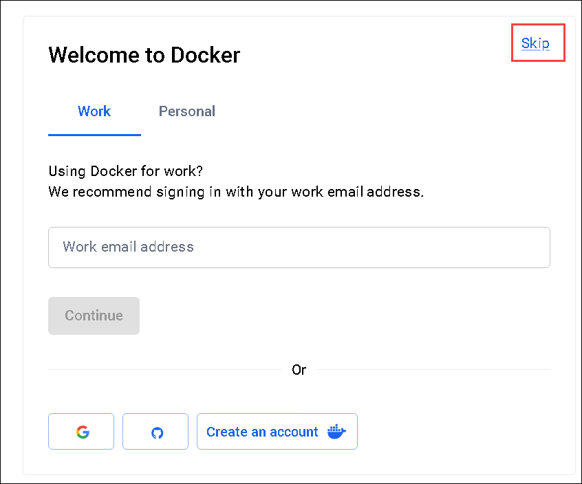
   
1. On the **Welcome Survey** page, click **Skip**.

   
   
1. On the **Sign in** page, click **Skip**.

   
   
1. If an error indicates that **WSL needs updating**, follow the steps below:

   
   
   - From Windows Search, type **PowerShell (1)** and select **Windows PowerShell (2)**.

      

   - Run the following command.

      ```
      wsl --update
      ```

      

   - From the system tray, click the **arrow icon (1)**, right-click **Docker Desktop (2)**, and select **Quit Docker Desktop (3)** to stop the service.

      

   - Click **Start (1)** at the bottom of the screen, search for **Docker Desktop (2)**, and open the **Docker Desktop (3)** again.

      

2. On the **LabVM**, click **Start (1)** at the bottom of the screen and select **File Explorer (2)** from the menu.

   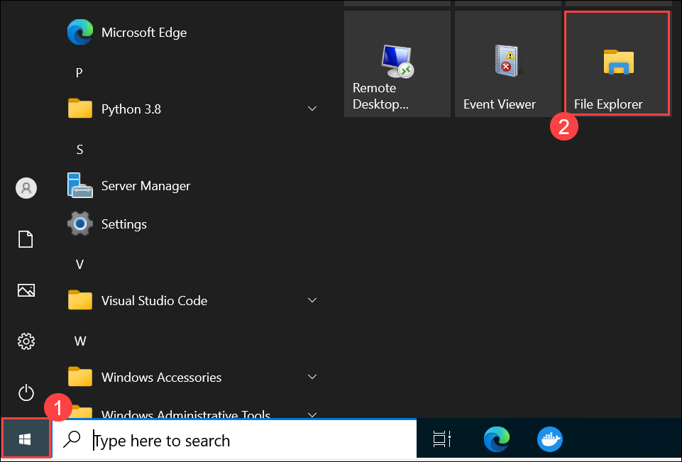

1. In **File Explorer**, navigate to: `C:\LabFiles\java-migration-copilot-samples\asset-manager`

   

1. In the File Explorer address bar, replace the path `C:\LabFiles\java-migration-copilot-samples\asset-manager` with **cmd**, then press **Enter**.

   

1. This will open a Command Prompt window. In the Command Prompt window, type the following command and press **Enter**:

   ```
   scripts\startapp.cmd
   ```

   

1. This will use the local file system instead of S3 to store images and launch RabbitMQ and PostgreSQL using Docker. 

1. Copy the **web application URL**, **RabbitMQ Management URL**, along with the **username** and **password**, and note them down in a Notepad for later use.

   

   > **Note:** If two Windows prompts appear, minimize them and let them run in the background. **Do NOT interrupt** the process.

   > 

   > **Note:** If you encounter any errors in the terminal, repeat the steps to run the application again.

   > 

1. Minimize all the command prompt windows and let them run.

1. In the Edge browser, open a new tab and enter **[http://localhost:8080](http://localhost:8080)**. You will be navigated to the **AWS S3 Asset Manager** web page.

   

1. In a new browser tab, enter the following **URL (1)** and sign in using the credentials:

   ```
   http://localhost:15672
   ```

   - **Username:** guest **(2)**
   - **Password:** guest **(3)**
   - Click on **Login (4)**.

      

1. You will be navigated to the **RabbitMQ Management** web page.

   

1. From the **Lab VM** desktop, double-click on the **Visual Studio Code** shortcut on the desktop of your virtual environment.

   

1. On the **Welcome to VS Code** page, click on **Continue with GitHub**. 

   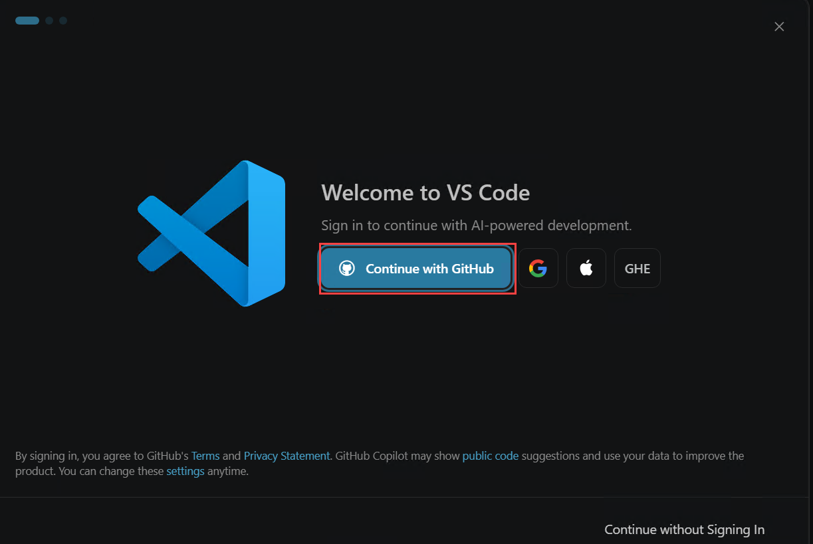

1. Enter the following details to sign in:

   - Username: **odl-user-<inject key="DeploymentID" enableCopy="false"/>_clabs (1)**
   - Click on **Sign in with your identity provider (2)**.

      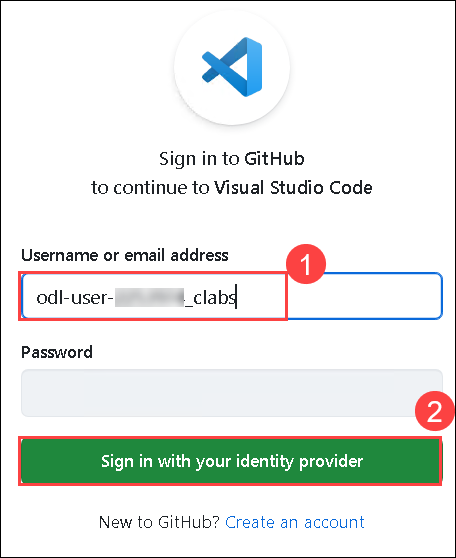

1. On the Single Sign-On to CloudLabs Organizations, select **Continue**.

   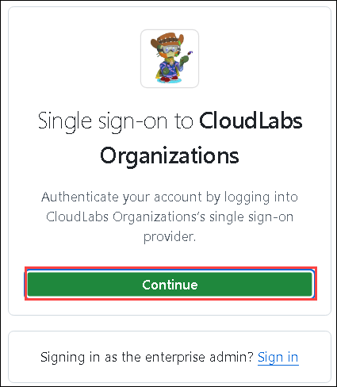

1. On the Permissions requested window, click on **Accept**.

   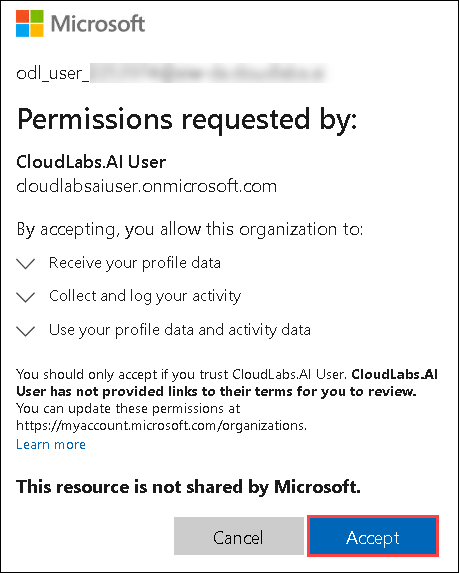

1. On the Authorize Visual Studio Code page, click on **Continue** to select the account to authorize.

   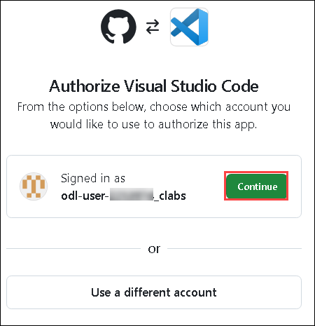

1. Click on Authorize Visual Studio Code.

   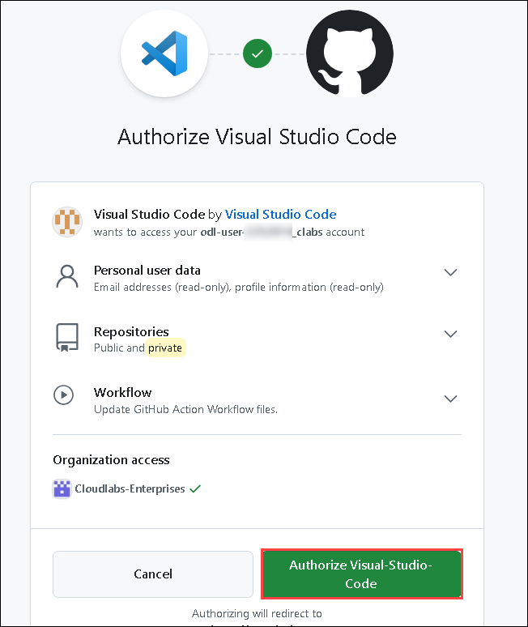

1. When prompted, click **Open** to allow vscode.dev to launch the project in **Visual Studio Code**.

   

1. In VS Code, close the Make it yours page by clicking on the **X** icon.

   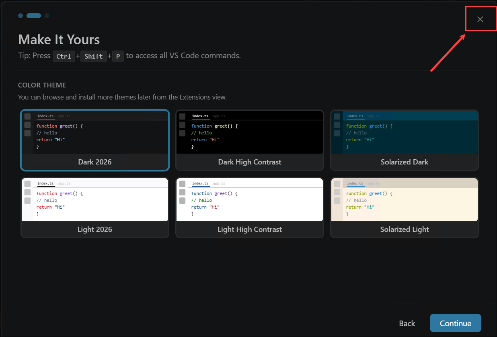

1. Click on **Explorer (1)** and select **Open Folder (2)** from the options.

   

1. From File Explorer, navigate to `C:\LabFiles\java-migration-copilot-samples` **(1)**, select the **asset-manager (2)** folder from the Quick Access section, and click on **Select Folder (3)**.

   

1. On the pop-up window for **Do you trust the authors of the files in this folder?**, select **Yes, I trust the authors**.

    

1. Click on the **Extensions (1)** button on the left-hand banner, search for **GitHub Copilot modernization (2)** and **Install (3)** the extension.

    

1. In **GitHub Copilot Chat**, click the **model selector (1)** located below the prompt text box and select **Claude Sonnet 4.6 (2)** from the dropdown menu.

   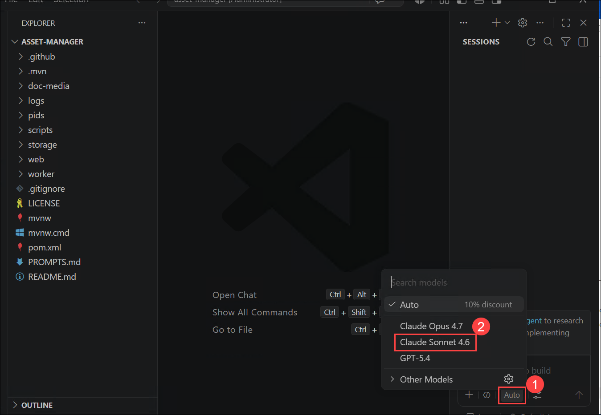

1. Open the **GitHub Copilot modernization (1)** extension from the left panel. In the **QUICKSTART** view, click the **Start Assessment (2)** button to start the app assessment.

   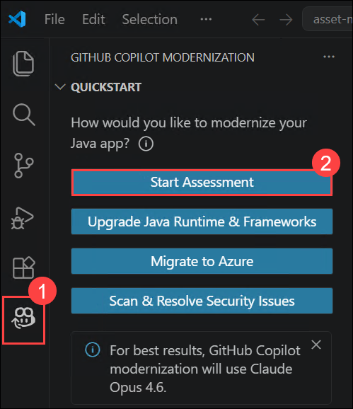

1. On the Assessment Reports screen, select **Recommended Assessment** to proceed with the default evaluation setup.

   

1. In the Recommended Assessment dialog, select the required domains and click **OK** to continue.

   

1. Please wait until the assessment is completed and the report is generated. Once generated, it will automatically open in a new tab.
   
   > **Note:** The report generation may take about 5 minutes.

1. Review the **Assessment Report**. Select the **Issues** tab to view the proposed solutions for the issues identified in the report.

   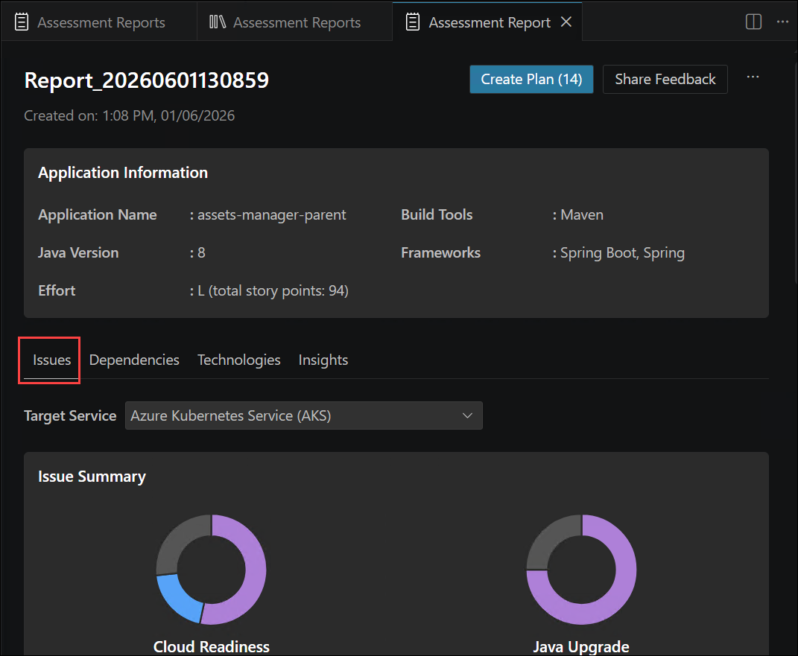

In this task, you have successfully analyzed the existing Java application using GitHub Copilot App Modernization to identify framework versions, code issues, migration blockers, and readiness for modernization and cloud migration.   

### Task 2: Upgrade Runtime and Frameworks (Optional)

In this task, you will use predefined Copilot tasks to automatically upgrade the project’s Java runtime version and frameworks such as Spring/Spring Boot. Copilot will analyze the application, apply necessary version updates, recommend fixes, and commit changes in a new branch.

   >**Note**: This task is optional, as in this lab, we are already using JDK 25, the latest version of Java. In real-world scenarios, applications may run on older Java versions (e.g., Java 8/11), and upgrading to the latest version is recommended for better security, performance, and compatibility.

1. From the **Github Copilot modernization (1)** from the left side, select **Upgrade Java Runtime & Frameworks (2)**. This will open the Copilot Chat panel with a predefined prompt to upgrade the Java runtime and frameworks **(3)**.

    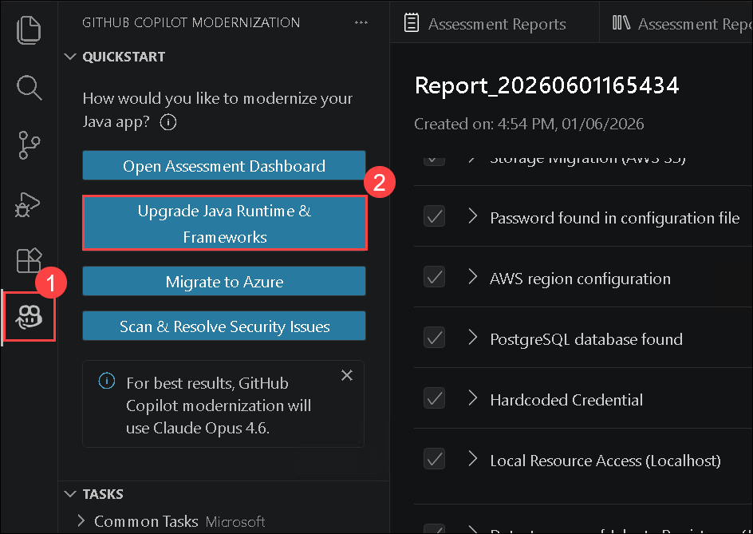

    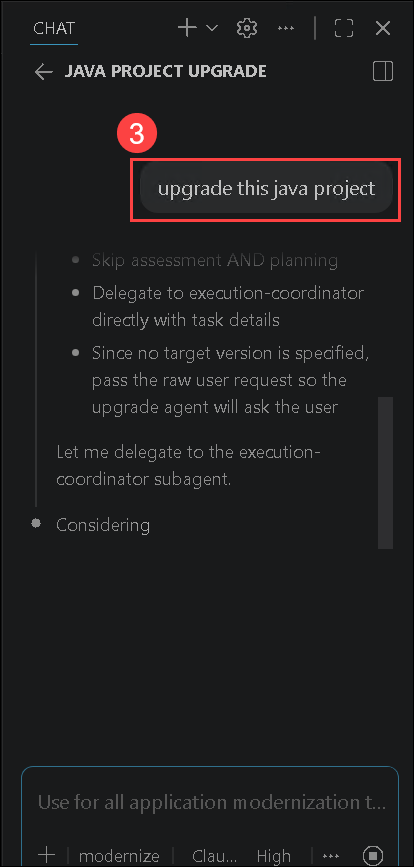

1. If prompted to choose the Java or Springboot versions to upgrade to, select the latest versions available.

   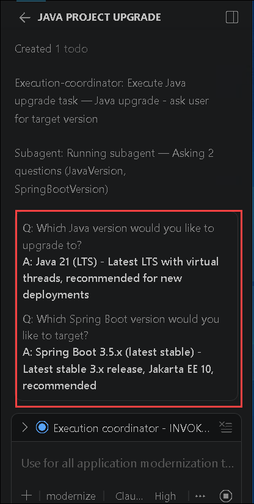

   > **Note:** Copilot may sometimes prompt to ask to generate a test. Please select Skip test, as it is not required for this lab.

1. The agent will check out a new branch and start upgrading the JDK version and Spring/Spring Boot framework. Click **Allow** for any requests from the agent whenever they appear.

   >**Note** : **Do not interrupt** while the provisioning or deployment scripts are running.

   

1. If prompted, click **Allow** to grant the required permissions.

1. In the Visual Studio Code prompt, click **Allow** to sign in with GitHub.

   

1. If prompted, in the account selection prompt, choose **odl-user-<inject key="DeploymentID" enableCopy="false"/>_clabs** to proceed with authentication.

   

   >**Note**: Do not select the **Fix CVE** or **Generate Unit Tests** options during this step, as they are not required for the current lab objectives.

   > 

   >**Note**: Please wait while Copilot completes the task, which may take approximately 20–30 minutes.
   
   > **Note:** Click on Keep to save the changes Copilot made to the files.

In this task, you have successfully upgraded the Java runtime and Spring/Spring Boot frameworks using predefined Copilot tasks to ensure the application is secure, modern, and cloud-ready.   

### Task 3: Generate and Review the Modernization Plan

In this task, you will use GitHub Copilot to generate a comprehensive modernization plan based on the assessment report. The plan will outline the necessary steps, code changes, and infrastructure updates required to modernize the application and migrate it to Azure. You will review the generated plan, understand the proposed changes, and prepare for the subsequent migration tasks.

1. On the Assessment Report, select the following:

    - Target Service: **Azure Kubernetes Service (AKS) (1)**
    - Click on **Create Plan (2)**

        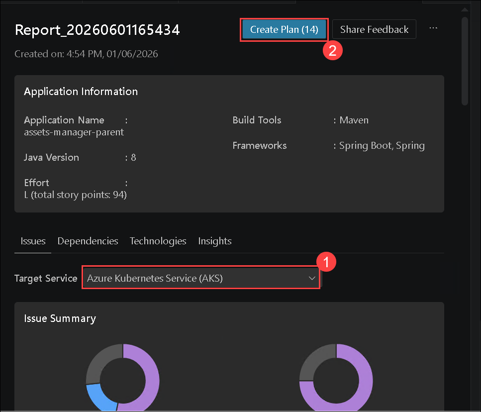

1. The Copilot Chat panel will open with a predefined prompt to generate a modernization plan based on the assessment report. 

    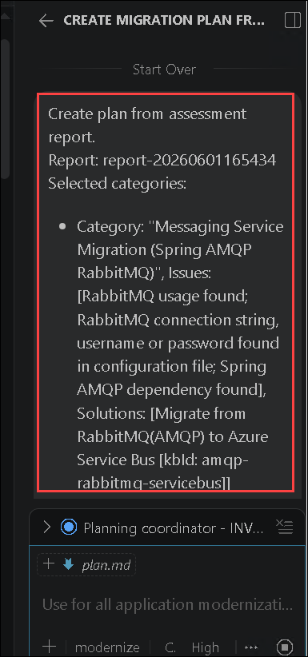

1. When prompted, click on **Allow** to run the agent that will analyze the application and generate a detailed modernization plan.

   > **Note:** Please wait while Copilot completes the task, which may take about 15-20 minutes.

1. At the end, it will ask you **The plan is ready, what would you like to do?**, select **Review the plan first**.     

    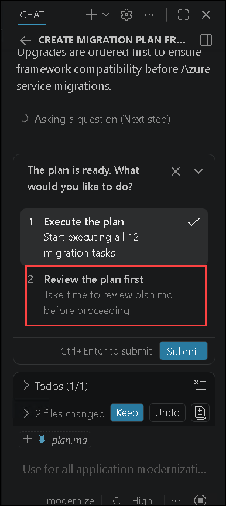

   > **Note:** Click on Keep to save the changes Copilot made to the files.   

1. The `plan.md` file will open in VS Code, review the plan Copilot created, then proceed with the next task. 

In this task, you have successfully generated a comprehensive modernization plan using GitHub Copilot based on the assessment report. You have reviewed the proposed changes and are now prepared to execute the modernization tasks in the subsequent task.

### Task 4: Execute Core Modernization Tasks  

In this task, you will execute the core application modernization activities identified in the modernization plan generated by GitHub Copilot App Modernization. Rather than executing each migration recommendation separately, you will use GitHub Copilot Agent to implement the primary application code and configuration changes in a single workflow.

The agent will analyze the approved modernization plan and apply the required changes to migrate messaging, storage, and database integrations to Azure-native services. This approach reduces repetitive execution steps while still demonstrating the end-to-end modernization capabilities of GitHub Copilot.

   > **Note:** In this lab, we focus on the core application modernization activities to reduce execution time and improve the learning experience. Infrastructure provisioning, deployment automation, and container deployment activities will be performed in later tasks.

   > In real-world modernization projects, organizations typically execute the complete modernization plan, including infrastructure provisioning, security integrations, deployment pipelines, monitoring, and operational configurations as part of a broader migration strategy.

1. In the Copilot Chat panel, enter the following prompt to execute the modernization plan:

    ```
    Execute the approved modernization plan. 
    
    Implement: 
    - RabbitMQ to Azure Service Bus migration 
    - AWS S3 to Azure Blob Storage migration 
    - PostgreSQL Managed Identity integration 
    
    Do not provision infrastructure. 
    Do not deploy the application. 
    Do not run extensive tests.
    ```

    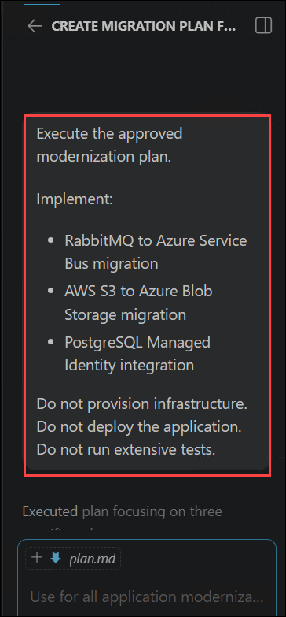

    > **Note:** When prompted, click on **Allow** to let the agent run and implement the modernization tasks. This process may take approximately 30–40 minutes to complete.

    > **Note:** Do not interrupt while provisioning scripts, migration scripts, or code transformation tasks are running.

1. Note in the above prompt, we have specifically asked the agent to **not provision infrastructure or deploy the application yet**, as we want to focus on code changes and framework upgrades in this step, and the infrastructure provisioning and deployment will be covered in the next tasks.    

1. During execution, GitHub Copilot **may** generate or update the following files:

   * progress.md
   * tasks.md
   * Additional migration and configuration files

   Review these files to monitor the modernization progress.

1. After the agent has completed executing the modernization plan, review the code changes, configuration updates, and migration scripts generated by the agent to understand the modifications made to modernize the application.

In this task, you have successfully executed the modernization plan using GitHub Copilot Agent to implement service migrations and code transformations required to modernize the application. You have reviewed the changes made to ensure the application is now modernized and ready for the next steps of infrastructure provisioning and deployment.

### Task 5: Expose health endpoints using Custom Tasks

In this task, you will create and execute a custom GitHub Copilot App Modernization task to expose application health endpoints using Spring Boot Actuator.

Modern cloud platforms continuously monitor deployed applications to determine whether they are healthy and able to serve requests. Platforms such as Azure Kubernetes Service (AKS) and Azure Container Apps use health endpoints to verify that an application has started successfully and remains operational.

GitHub Copilot will use a custom task and reference documentation to analyze the application, add the required Spring Boot Actuator dependencies and configuration, and expose health endpoints that can be used by cloud-hosted environments.

1. Open the sidebar of `GITHUB COPILOT MODERNIZATION`. Click the `+` button in the **Tasks** view to create a Custom Skill.

   

1. A **Create a Skill** form opens with the following fields. Fill them in as shown below:

     - **Skill Name:** `expose-health-endpoint` **(1)**
     - **Skill Description:** This skill helps add Spring Boot Actuator health endpoints for Azure Container Apps deployment readiness. **(2)** 
     - **Skill Content:**  You are a Spring Boot developer assistant. Follow the **Spring Boot Actuator documentation** to add basic health endpoints required for Azure Container Apps deployment. **(3)**
     - Click on **Save (4)**.

       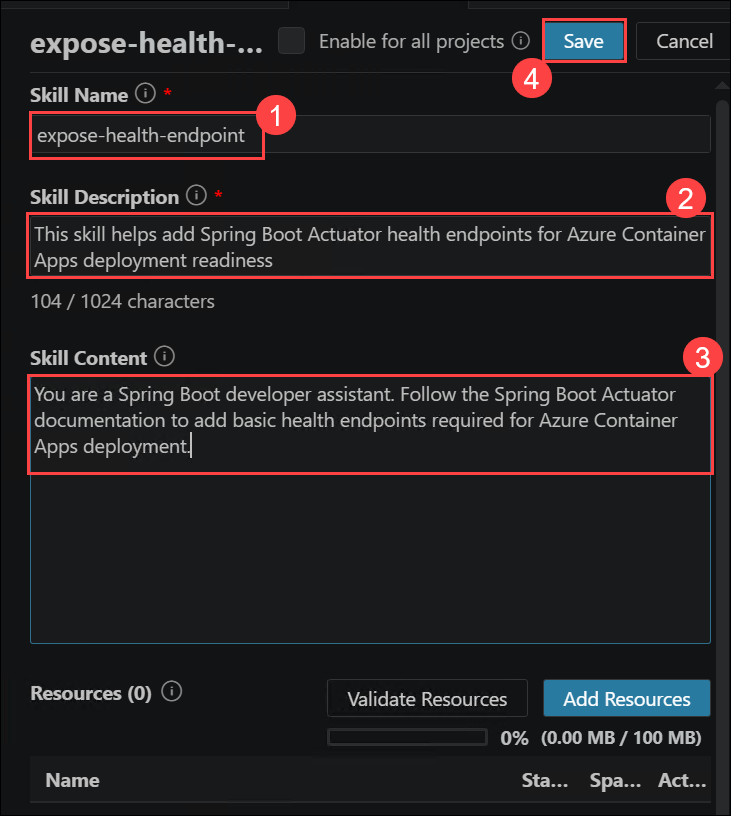

1. Click the **Run Task** button to trigger the custom task.

   
   
   >**Note** : If you see **Run Skill** instead, click **Run Skill** to trigger it.

   > 

1. Wait for the predefined deployment prompt to appear in the Copilot Chat panel with Agent Mode enabled. Click inside the prompt text in Copilot Chat. Edit and add the following sentence to the **prompt (1)**, then click on **send (2)**.

   ```
   Resource link: https://docs.spring.io/spring-boot/reference/actuator/endpoints.html
   ```
   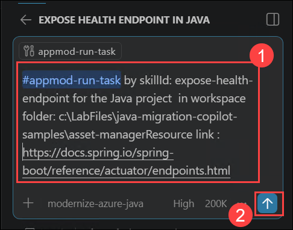
   
1. Review the proposed code changes and click **Keep** to apply them.

   >**Note**: Please wait while Copilot completes the task, which may take approximately 20–30 minutes.
   
In this task, you have created and executed a custom Copilot task to enable Spring Boot Actuator health endpoints for application monitoring and Azure readiness probes.

### Task 6: Containerize Applications

In this task, you will containerize the application using GitHub Copilot App Modernization.

Containerization packages an application and its dependencies into a portable image that can run consistently across development, testing, and production environments. Containers are a foundational building block for modern cloud-native deployments and Kubernetes-based platforms such as Azure Kubernetes Service (AKS).

GitHub Copilot will analyze the application structure, generate a containerization plan, create Dockerfiles, build container images, and help resolve any build issues encountered during the process.

1. Open the **GITHUB COPILOT MODERNIZATION (1)** from the sidebar menu. In **Tasks** view, expand the **Common Tasks** -> **Containerize Tasks** **(2)** and click on **Run task**  button **(3)** for **Containerize Application** task.
  
    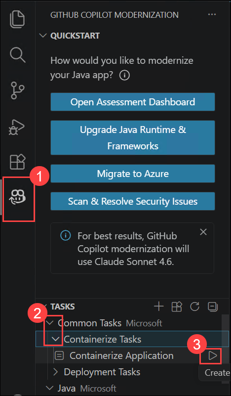

1. When prompted, click **Continue** or **Allow** in chat notifications, or type **y** / **yes** in the terminal as Copilot Agent follows the plan and leverages agent tools to create and run provisioning and deployment scripts, fix potential errors, and complete the deployment.  

   >**Note** : **Do not interrupt** while the provisioning or deployment scripts are running.

1. A predefined prompt will be populated in the **Copilot Chat panel** with **Agent Mode** enabled.  
   Copilot Agent will analyze the workspace and create a file named **containerization-plan.copilotmd** containing the containerization plan.

   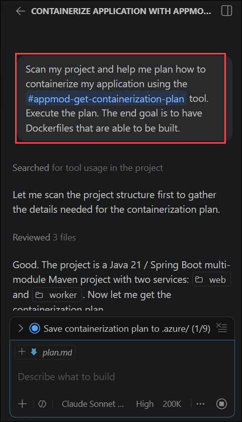

1. View the plan and collaborate with Copilot Agent as it follows the **Execution Steps** in the plan by clicking **Continue**/**Allow** in pop-up chat notifications to run commands. Some of the execution steps leverage agentic tools of **Container Assist**.
    
1. Copilot Agent will help generate Dockerfile, build Docker images, and fix build errors if there are any. Click **Keep** to apply the generated code.

   >**Note**: Please wait while Copilot completes the task, which may take approximately 20–30 minutes.

1. Navigate to the **worker (1)** folder in VS Code and verify that the **Dockerfile (2)** is created.

    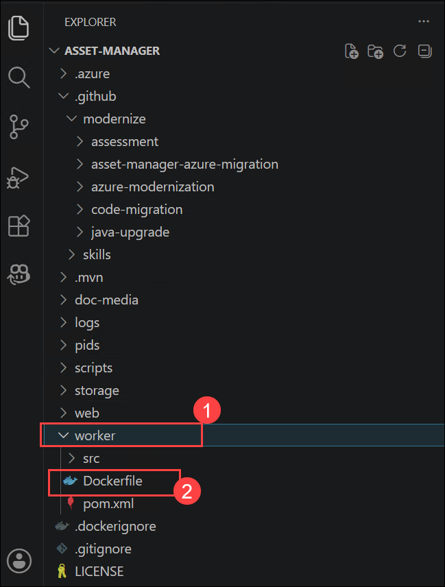

In this task, the application was containerized using the GitHub Copilot App Modernization Containerization Task, where Copilot generated the containerization-plan.copilotmd, created Dockerfiles for the application modules and successfully built Docker images with all changes accepted via “Keep”. These Docker artifacts (Dockerfiles and images) are then used as deployment inputs in Task 8, where the application is provisioned and deployed to Azure Kubernetes Service.

### Task 7: Deploy to Azure

In this task, you will deploy the modernized and containerized application to Azure using GitHub Copilot App Modernization.

GitHub Copilot will generate a deployment plan, recommend Azure services, provision the required Azure resources, deploy the application, and validate the deployment.

By the end of this task, the application will be running on Azure Kubernetes Service (AKS) and integrated with Azure-native services introduced during the modernization process.

1. Open the sidebar of **GITHUB COPILOT APP MODERNIZATION** **(1)**. In **Tasks** view, expand **Common Tasks** -> **Deployment Tasks** **(2)** and click on the **Run task button (3)** for Provision Infrastructure and Deploy to Azure.

    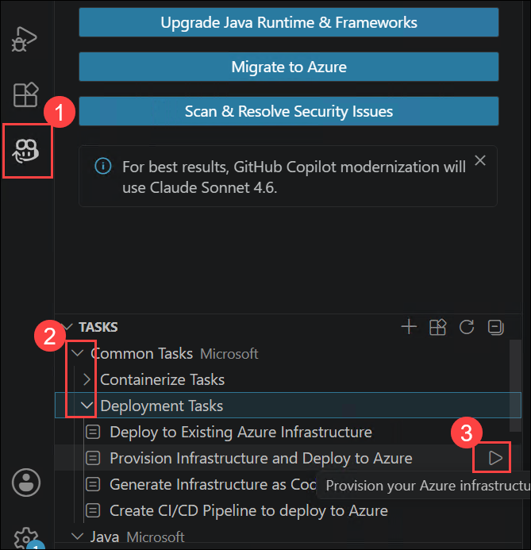

1. Wait for the predefined deployment prompt to appear in the Copilot Chat panel with Agent Mode enabled. Click inside the prompt text in Copilot Chat to **Edit** the last sentence of the prompt to **Hosting service: AKS** **(1)** and click on the **Send (2)** button.

   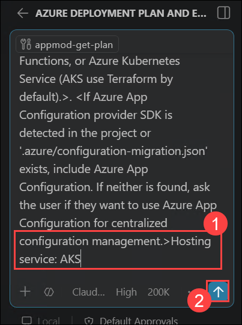

1. GitHub Copilot will prompt you to log in to Azure. To log in, follow the steps mentioned below: 

   - Click on the link **(1)** that GitHub Copilot shows in the chat, which opens a browser page. 

   - On the browser page, copy and paste the Code that Copilot displays in the chat.

      > **Note:** The code would be different for you and will not be the same as the image below.

      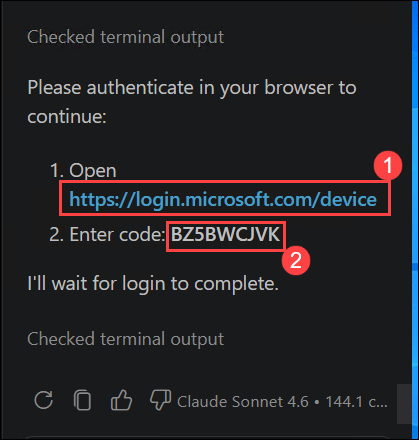

   - After entering the code, click on Next and then Continue and navigate back to VS Code.

      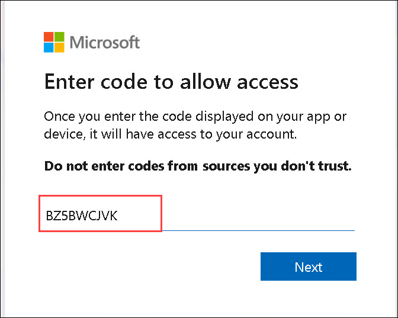

   - In the GitHub Copilot chat type - **Login complete** and send. 

      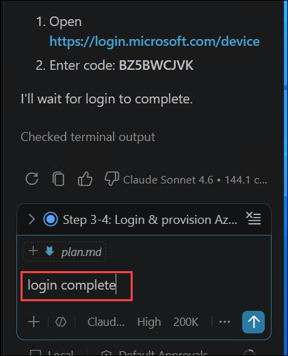   

   > **Important:** GitHub Copilot might ask you to log in in a different way, but it will showcase the steps; make sure you follow the steps it shares to log in.  

1. Once the prompt is executing, click **Continue**/**Allow** if pop-up notifications to let Copilot Agent analyze the project and create a deployment plan in **plan.copilotmd** with Azure resources architecture, recommended Azure resources for the project, security configurations, and execution steps for deployment.

   > **Note:** If Copilot asks to execute the plan, click on Execute/Yes as prompted.

1. If prompted to enter a password for PostgreSQL flexible server, enter any suitable password **(1)** and **submit (2)**. 

      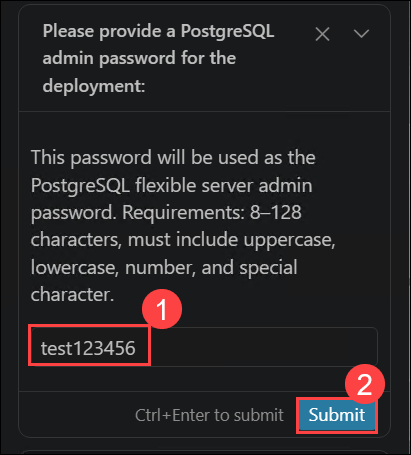  

1. When prompted, click **Continue**/**Allow** in chat notifications or type **y**/**yes** in the terminal as Copilot Agent follows the plan and leverages agent tools to create and run provisioning and deployment scripts, fix potential errors, and finish the deployment. You can also check the deployment status in **progress.copilotmd**. 

   >**Note** : **Do not interrupt** while the provisioning or deployment scripts are running.

   >**Note**: Please wait while Copilot completes the task, which may take approximately 30–45 minutes.

1. Once the deployment is completed, you can view the deployment status as below: 

   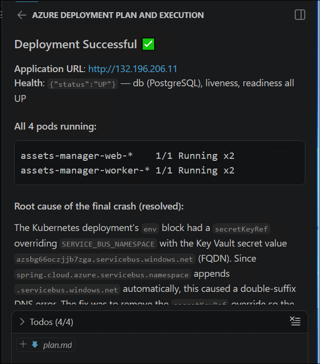

   > **Note:** The response generated by the above prompt may vary. If your prompt returns an error, press **Ctrl + C** to copy the error and **Ctrl + V** to paste it in the Copilot chat and run. GitHub Copilot should automatically resolve the errors.

   >**Note:** If you face error: **Hmmm… can't reach this page**, terminate the chat and add the below given prompt.

   > ```
   > Migrate the PostgreSQL database to Azure Database for PostgreSQL Flexible Server, and deploy only the web application to Azure Kubernetes Service (AKS).
   > ```
 
1. Now we will navigate to Pods and check if they are running and try to access the External IP.

   >**Note:** If you encounter any errors, copy those errors and paste in Copilot chat. GitHub Copilot should automatically resolve the errors.

1. In the Edge browser, navigate to the **Azure portal** and select **Resource Groups**.

   

1. On the **Resource Groups** page, select the newly created resource group. The resource group name might be different from the image below, as Copilot will create it with its own given name. 

   

1. You will now see that all the resources have been successfully deployed in the Azure portal.

   

1. To access the web application, navigate to the **AKS resource** in the Azure portal.

   

1. From the left navigation pane, expand **Kubernetes resources (1)**, click on **Services and Ingresses (2)** and click the **External IP address (3)** of the web service.

   

1. You will be redirected to a new tab where your web application is displayed.

   
   
   >**Note:** If you encounter any errors in accessing the application, copy those errors and paste them in the GitHub Copilot chat. GitHub Copilot should automatically resolve the errors.

In this task, you have deployed the fully modernized and containerized application to Azure Kubernetes Service (AKS) by provisioning infrastructure, executing deployment scripts, and validating resources in the Azure portal.

## 🧾 Summary

By completing this lab, you used **GitHub Copilot App Modernization** to modernize the Asset Manager application and prepare it for deployment on Azure. You assessed the application, generated and executed a modernization plan, migrated key application components to Azure-native services, enabled health monitoring with Spring Boot Actuator, containerized the application, and deployed it to **Azure Kubernetes Service (AKS)**. This lab demonstrated how GitHub Copilot can accelerate application modernization through AI-assisted assessment, planning, code transformation, containerization, and deployment.

### Key Skills Learned

* Assessing Java applications for modernization readiness using GitHub Copilot App Modernization
* Generating and reviewing modernization plans
* Executing core application modernization tasks using GitHub Copilot Agent
* Migrating application components to Azure-native services
* Enabling application health monitoring with Spring Boot Actuator
* Containerizing Java applications using Docker
* Provisioning Azure infrastructure and deploying applications to Azure Kubernetes Service (AKS)
* Using GitHub Copilot to automate and accelerate application modernization workflows

### 🎉 You have successfully completed the lab!
